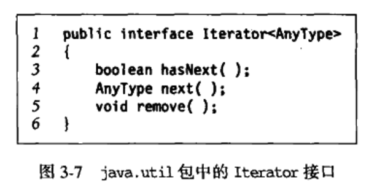
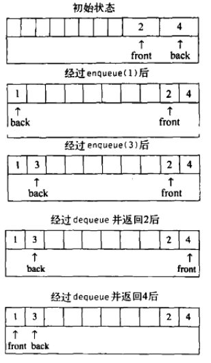
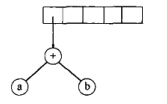

<!-- GFM-TOC -->
* [一.引论](#一引论)
   * [1.数学基础](#1数学基础)
      * [1.1 基本公式](#11-基本公式)
      * [1.2 证明方法：归纳法（较多）和反正法](#12-证明方法：归纳法（较多）和反正法)
   * [2.递归](#2递归)
   * [3.泛型特性](#3泛型特性)
      * [3.1 泛型类和接口](#31-泛型类和接口)
      * [3.2 带限制的通配符](#32-带限制的通配符)
      * [3.3 类型限定](#33-类型限定)
* [二.算法分析](#二算法分析)
  * [1.折半查找](#1折半查找)
  * [2.最大公因数的欧几里得算法](#2最大公因数的欧几里得算法)
  * [3.幂运算](#3幂运算)
* [三.表、栈和队列](#三表、栈和队列)
  * [1.抽象数据类型（ADT](#1抽象数据类型（ADT)
        
<!-- GFM-TOC -->

# 一.引论

## 1.数学基础

### 1.1 基本公式

### 1.2 证明方法：归纳法（较多）和反正法

​		    第一步证明基准情况：确定定理在某个（些）很小的值得正确性，然后进行归纳假设，即假设定理对直到某个有限数k的所有情况成立，然后用这个假设证明下一个值（k+1）也是成立的。

## 2.递归

​		递归的两个基本法则：1.基准情况：必须要有某个基准情况，不用递归就能求出。2.不断推进，对于递归求解的情况，递归调用必须朝着一个基准情况推进，如无基准值，则计算机将一直反复计算，直至内存占满，程序崩溃。

## 3.泛型特性

​		除去对象的类型外，实现方法相同的，可以用泛型实现，Java使用像Object这样的超类来实现泛型类，只有引用类型能够与Object相容，基本数据类型不能是使用。为此，Java为8中基本数据类型提供了包装类，每一个包装类都是不可改变的，它存储了当该包装对象被创建时所设置的值，并提供一种方法重新获得此值。

### 3.1 泛型类和接口

​	                          

​	当定义一个泛型类是，类的声明则包含一个或多个类型参数，这些类型参数放在类名后面的<>内，这个例子对参数没有明显的限制，所以用户可以创建GenericMemoryCell<String>和GenericMemoryCell<Integer>这样的类型，但是不能创建GenericMemoryCell<int>这样的类型。

​                             

​	在Java5之前，comparable接口不是泛型的，它的compareTo方法需要一个Object最为参数，则传入此方法的即使不是合理的类型都能通过编译，但是在运行时会出现ClassCastException，Java中，comparable是泛型的，通过使用泛型类，将运行时错误变成了编译时错误。

### 3.2 带限制的通配符

假如，Circle和Square是Shape的两个子类，Java中的数组是协变得，所以，Circle[] IS-A Shape[]，使用泛型的原因就是把运行时错误转变为编译时错误，所以，泛型集合是不协变的，Collection<Circle> IS-NOT-A Collection<Shape>，则public static void total（Collection<Shape>），传入Collection<Circle>是不能正常运行的，于是通配符解决了这个问题，public static void total（Collection<？ extends Shape>）。

### 3.3 类型限定 

 

只有在AnyType是Comparable的情况下才能保证compareTo的调用时合法的。一种自然的写法就是public static <AnyType extends Comparable>，但更好的做法是  public static <AnyType extends Comparable<AnyType>>，但是这个方式还是有个问题，最理想的方式是，AnyType IS-A Collection<T>，T是AnyType的父类，所以为public static <AnyType extends Comparable<? super AnyType>>

# 二.算法分析

  第一行和第四行各占一个时间单元，第三行每执行一次消耗4个时间单元（2次乘法，1次加法，1次赋值），执行N次，共4N个时间单元，第二行在初始化一个时间单元，测试i<n，N个时间单元，自增开销，总量6N+4个时间单元，O（N）

​	程序运行时间以指数的速度增长，这个程序之所以如此缓慢，是因为存在大量的重复工作，在第一次调用f（n-1）时实际上在某处f（n-2）已被计算，这个信息被抛弃，而在第二次被调用的时候被重新计算一次，抛弃的信息量递归起来并导致巨大的运行时间。

​	运行时间中的对数：对数最常出现的规律可概括为，如果一个算法用常数时间将一个问题的大小消减为其一部分（通常为1/2），那么算法就是O(logN)，如果使用常数时间只是把问题减少了一个常数的数量，那么这种算法就是O(N)的。

## 1.折半查找

​	每次迭代内部花费O(1)，循环从high-low=N-1开始到high-low=-1截止，每次循环后high-low的值至少将循环次数折半，所以循环次数最多为

​	折半查找它提供了在O(logN)时间内的contains操作，但其他操作（insert）均需要O(N)时间，在**数据稳定（即不允许插入操作和删除操作）**的应用中，这种操作是十分有效的。

## 2.最大公因数的欧几里得算法

假设M>=N，如果小于，则循环的第一次迭代将它们互换,

## 3.幂运算

计算X^N，明显的算法是X的N次自乘，一种递归算法效果更好，当N为偶数时X^N = X^(1/2)*X^(1/2)

当N为奇数时X^N = X^(1/2) * X^(1/2) *X，

算法需要的乘法最多为2*logN

而pow（x,n）=pow(x,n/2)*pow(x,n/2)，程序效率并不高，此时有两个N/2的递归，高效的实现为：

​                   

# 三.表、栈和队列

## 1.抽象数据类型（ADT）

​	抽象数据类型是带有一组操作的一些对象的集合，对于集合（ADT）有添加（add）、删除（remove）、以及包含（contains）这样一些操作。

## 2.表ADT

​	将型如A0，A1，...，An-1的一般表，除空表外，我们称Ai后继Ai-1，Ai-1前驱Ai，与这些定义相关的就是要在表ADT上进行操作的集合。

###  2.1表的数组实现

​	如果存在这样一种情形：表示通过在高端进行插入构建的，其后只发生对数据的访问，在这种情况下，数据是表的一种合理的实现。然而，如果发生对表的一些插入，删除操作，特别是在表的前端进行，则数据不是表的一种好的实现。

###  2.2表的链表实现

###  2.3Java Collection API

​	集合（Collection）它存储一组类型相同的对象，Collection 接口扩展了Iterable接口，实现Iterable接口的那些类可以使用增强的for循环，下图显示了Collection接口的部分功能，

​	实现Iterable接口，必须提供一个iterator方法，该方法返回一个Iterator对象，Iterator对象定义如下：其中next方法试图使用当前位置作为小标访问数组元素然后将当前位置向后推进。

​	通过iterator方法，每个集合均可创建并返回给客户一个实现Iterator接口的对象，并将当前位置信息存储在对象内部，当编译器遇到增强版的for循环时，它将用iterator方法代替增强的for循环，自动由编译器重写为：

**Iterator接口中的remove方法，可以删除由next放回的最新的项**（此后不能在调用remove，直到对next的再一次调用），Collection的remove方法需要先搜索位置再删除，所以花费线性时间。当直接使用Iterator时，记住一个重要的法则：如果对正在被迭代的集合使用结构上的改变（如，add，remove，clear），那么迭代器就不再合法（之后使用该迭代器将抛出ConcurrentModificationException）。这样是为了避免迭代器正准备给出下一项时，此项被删除或者在此项前被插入 一个新项的讨厌情况。

### 2.4List、ArrayList、LinkedList

表（list），它由java.util包中的List接口指定，List接口继承了Collection接口，外加了一些方法，get和set是用户可以**访问和改变制定位置索引ids位置上的项**

​	List ADT有两种流行的实现方式，ArrayList提供了一种可增长数组的实现，使用ArrayList的优点是，对于get，set花费常数项时间，其缺点是在插入和删除代价昂贵，除非是在数组末端，LinkedList提供了双链表的实现，，优点在于加入位置已知插入和删除操作开销很小，在表的末端和始端操作都是常数时间，所以LinkedList提供了addFirst、addLast、getFirst和getLast更加有效地处理两端情况，缺点是不易作索引，get代价高昂。对于搜索而言，ArrayList和LinkedList都是低效的，对Collection的contains和remove均花费线性时间。另外，ArrayList有一个**容量的概念，它表示基础数组的大小**，在需要的时候，ArrayList将自动增加其容量以保证具有表的大小，trimToSize可以在所有的添加操作完成后使用避免浪费空间。

上述程序无法正常运行，如前面所述，因为在删除一项后，增强的for循环的基础迭代器是非法的。

ListIterator接口扩展了Iterator的功能，方法previous和hasPrevious使得表的从后向前遍历得以完成。

#### 2.4.1 ArrayList实现

#### 2.4.2 LinkedList实现

​	实现中的附加数据项modCount用来帮助迭代器检测集合中的变化，modCount代表自从构造以来对链表所作的改变的次数。每次对add和remove的调用都将更新modCount，想法在于，当一个迭代器建立时，他将存储集合的modCount，每次迭代器方法（next和remove）的调用都将用该链表内的当前modCount和存储在迭代器中的modCount比较，如果不相等将抛出ConcurrentModificationException异常，也即是前面所说的，在迭代器使用过程中，迭代器是不允许改变的。

​	注：迭代器中的remove方法调用的是Collection中的remove方法，所以执行完remove后，modCount和expectedModCount各自减1，还是相等，其中的okToRemove是为了保证必须是调用了next方法后才能使用remove方法删除由next方法新返回的项，但是如果在迭代器被构建后，集合发生了改变（集合中的add、remove方法被调用）modCount与expectedModCount将不再相等，这样是为了检测迭代器使用期间集合被修改的情况。

## 3.栈ADT

### 3.1栈模型

​	栈是限制插入和删除只能在一个位置上进行的表，该位置便是表的末端，叫作栈的顶（top），栈又被称为LIFO（后进先出）表。

### 3.2栈实现

​	因为栈是一个表，所以任何实现表的方法都能实现栈，所以ArrayList和LinkedList都支持栈操作，设计一种特殊目的的实现可能会更快，因为栈操作是常数时间。对于空栈，topOfStack就是-1，为了将某个元素推入栈中，我们先使topOfStack加1，后置stackArray[topOfStack]=x,弹出元素时，x=stackArray[topOfStack]后使topOfStack减1。

### 3.3栈应用

​	**平衡符号**：检测没见事情是否是成对的程序，比如，每一个右花括号、右方括号、右圆括号必有对应的左括号。一个简单的栈算法：做一个空栈，读入字符直至文件末尾，如果字符是一个开放符号，则入栈，如果字符是一个封闭符号，当栈为空则报错，否则将元素弹出，弹出的字符不是对应的开放字符，则报错，在文件结束，如果栈非空则报错。时间花费是O(N)，因为对输入中的每个字符的处理都是一些栈操作组成从而花费常数时间。

​	**后缀表达式**：4.9 * 1.6+5.5+6.3 * 1.6的中缀表达式为4.9 1.6 * 5.5 + 6.3 1.6 * +，计算中缀表达式的最容易的一个方法就是使用一个栈，例如表达式6 5 2 3 + 8 * + 3 + *，计算过程如下：

​	**中缀到后缀的转化**：将一个标准表达式（中缀表达式）转化为后缀表达式，算法的思想就是，当看到一个操作符时，把它入栈，栈代表挂起的操作符，然后，栈中具有高优先级的操作符现在知道当它们不再被挂起时要完成使用，应该被弹出，那么，在把当前操作符入栈之前，那些在栈中并在当前操作符之前需要完成的操作符应该被弹出。例如，a+b * c + （d * e + f）* g应该被转化为 abc * de * f + g * +

​	首先将运算数a被读入，于是被传向输出，然后 + 被读入并放入栈中，接下来b被读入传向输出，状态为

​	接着 * 被读入，栈顶元素 + 优先级比 * 低，不输出，且 *入栈，接着c被读入并输出：

 	接着+ 被读入，栈顶元素 * 优先级比当前操作符+ 高，弹出并输出，直到比当前+优先级低的为止，

​	下一个被读到的（具有最高优先级，因此入栈，然后d被读入并输出，

​	下一个 * ，除非正在处理），否则开括号不会弹出栈，所以 * 入栈，下一个e被读入并输出

​	下一个 + ，栈顶元素 * 优先级比 + 高，弹出并输出，然后将 + 入栈，之后读到f并输出

​	下一个），因此将栈元素直到（弹出，但不输出

​	下一个 * ，栈顶元素+ 优先级比* 低，* 入栈

​	读入g并输出，直到末尾，依次弹出栈中元素

​	这种转化需要O(N)时间花费。

### 3.4 方法调用

​	当调用一个新方法时，主调例程的所有的局部变量需要由系统存储起来，否则被调用的新方法将会重写由主调函数所使用的内存，而且主调函数的当前位置也必须存储，以便新方法运行完后知道向什么地方转移。这些变量一般是由编译器指派给机器的寄存器。当方法调用的时候，所要存储的重要信息，诸如寄存器的值和返回地址等，均可由栈来完成，所要存储的信息称为**活动记录或者栈桢**。

## 4 队列ADT

​	队列也是表，只是使用队列是，插入在一端进行，删除在另一端进行。在表尾插入元素称为入队（enqueue），在表头删除元素叫出对（dequeue）。

### 4.1 队列实现

​	如同栈一样，对于任何的表的实现对于队列都是合法的，像栈一样，每一种操作，链表和数组的实现都是常数时间，

为使一个元素x入队，让currentSize和back增1，然后置theArray[back] = x，若使元素出对，先返回值theArray

[front]，currentSize减1，front增1，对于上述实现有一个潜在问题，存在队列中只有几个元素但是back已达到尾端位置队列已满，简单的解决方法是使用**循环数组**实现，如果front和back增1后超越了数组，其值重置为数组的第一个位置。

# 四.树

​	对于大量的输入数据，链表的访问时间太慢，树这种数据结构在大部分操作的运行时间平均为O(logN)。一棵树是N个节点和N-1条边的集合，路径的长为该路径上的边的条数，每一个节点都有它自己的一条长度为0的路径。对于任意节点ni，ni的深度为从根到ni的唯一路径的长，因此根的深度为0，ni的高为ni到一片树叶的最长路径的长。因此所有树叶的高为0，一棵树的高等于根节点的高。如图，E的深度为1高度为2，树高为3.

## 1.树的实现

​	实现树的一种方法是在每一个节点数据外还需要有一些链，使得该节点的每一个孩子都有一个链指向它，然而，由于每个节点的儿子数变化很大而且提前不可知，因此在数据结构中直接构建各个儿子节点的链接是不行的，这样会浪费大量的空间。树的第一儿子/下一兄弟表示法是一种典型的申明。

​	树点典型应用就是常用操作系统的文件系统，设我们要列出目录中所有文件的名字，输出格式为深度为di的文件被di次跳格缩进后打印其名，伪代码如下，这是一种先序遍历策略：

​	先序遍历，对节点的处理是在它的诸儿子节点处理之前进行的；后序遍历，对节点的处理是在它的诸儿子节点处理之后进行的。如下统计所占磁盘空间总大小的伪代码为后序遍历策略：

## 2.二叉树

​	**构造表达式树**：一种把后缀表达式转变为表达式树的算法，一次一次地将符号读入，如果符号是操作数，那么建立一个单节点树并将其入栈，如果符号是是操作符，那么就从栈中弹出两颗树T1和T2并形成一颗新的树，新树的根为操作符，它的左右儿子分别为T1和T2，然后将这颗新树压入栈中。例子：ab+cde+**

​	前两个符号是操作数，创建两个单节点并入栈

​	接着+被读入，两颗树弹出，形成一个新树，并入栈

​	接下来cde被读入

​	接下来+被读入，弹出两颗树形成一颗新树并压栈，

​	接下来 * 被读入，弹出两颗树形成一颗新树并压栈，

​	最后，最后一个字符被读入，两棵树合并，最后的树留在栈中，

## 3.二叉查找树

​	使二叉树成为二叉查找树，对于树中的每一个节点X，它的左子树中的所有项小于X的项，	它的右子树的所有项大于X的项。

### 3.1 contains方法

​	如果T为空集则返回false，如果T处存储的就是X则返回true，否则，对T的左子树和右子树进行一次递归调用，这取决于T中存储的值与X的关系。

### 3.2 findMin和findMax方法

​	从根节点开始，只要有左子树就向左进行，终止点就是最小的元素，同理，从根节点开始，只要有右子树就向右进行，终止点就是最大的元素。

### 3.3 insert方法

​	为了将X插入到树T中，使用contains，如果找到X，则什么都不用做，否则，将X插入到遍历路径的最后一点上。下图中，将5插入到树中，为了插入5，遍历树，在具有关键字4的节点，我们需要向右进行，但右子树不存在，因此5不在此树上，当前位置就是要插入的位置。

### 4.3 remove方法

​	删除需要考虑几种情况，如果节点是一个树叶节点，直接删除即可；如果删除节点有一个儿子，则该节点可以在其父节点调整链以绕过该节点后删除；最复杂的是删除节点有两个儿子，一般的删除策略是，用该节点的右子树的最小值（因为右子树的最小值没有左子树，第二次remove时较容易）代替该节点的数据并递归地删除最小值节点。

### 4.4平均情况分析

​	因为我们用常数时间在树中降低了一层，因此，所有操作的运行时间都是O（d），其中d是包含所访问的项的节点的深度。

​	假如所有的插入序列都是等可能的，则树的所有节点的平均深度为O（logN）。一棵树的所有节点的深度的和称为内部路径长。经过证明计算，上节的所有操作的平均运行时间都是O(logN)，但对于删除操作，因为我们总是使用右子树的一个结点来代替删除节点，在经过大量大量的删除后，树明显右沉，平均运行时间不再是O（logN），一连串的插入操作将可能花费二次时间。一种解决办法就是要有一个称为平衡的附加条件（**AVL树**）：任何节点深度均不可过深。另外，较新的方法（**伸展树**）是，放弃平衡条件，允许有任意的深度，但在每次操作后要使用一个调整规则进行调整，使后面操作效率更高。

## 4.AVL树

​	AVL树是带有平衡条件的二叉查找树，一棵AVL是其每个节点的左子树和右子树的高度最多差1的二叉查找树。除去可能的插入操作外，所有的树操作都可以以O(logN)时间执行，插入一个节点可能破坏AVL树的平衡性，如果发生这种情况，就要考虑在这一步插入完成后恢复平衡的性质，这总是可以通过对树进行简单的修正来做到，我们称为旋转。

